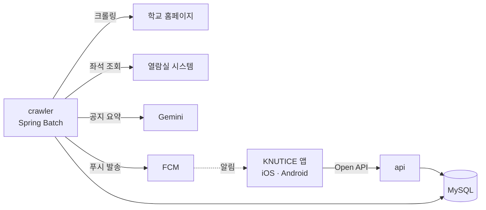

<p align="middle" >
  
</p>

<div align="center">
    <a href="https://apps.apple.com/kr/app/knutice/id6547855991">
        
    </a>
    <a href="https://play.google.com/store/apps/details?id=com.doyoonkim.knutice&hl=ko">
        
    </a>
</div>

# 프로젝트 소개

한국교통대학교 공지사항 · 학과 공지 · 학식을 수집해 구독자에게 **실시간 푸시 알림**으로 전달하는 서비스의 백엔드입니다.
학생들이 꼭 필요한 공지를 놓치지 않고, 효율적인 캠퍼스 라이프를 누릴 수 있도록 돕습니다.

| 기능 | 설명 |
| :-- | :-- |
| 공지 알림 | 일반 · 장학 · 행사 · 학사 · 취업 공지와 학과 공지를 크롤링해, 구독한 토픽의 새 공지를 FCM 으로 발송 |
| 학식 알림 | 평일 학생식당 · 교직원식당 메뉴 발송 |
| AI 요약 | Gemini 로 공지 본문을 요약해 제공 |
| 열람실 빈자리 알림 | 원하는 좌석이 비면 즉시 알림 |
| 다국어 알림 | 기기 언어(한국어 · 영어 · 일본어)에 맞춘 알림 제목 · 문구 |

# 사용 기술

| 구분 | 기술 스택 |
| :-- | :-- |
| Backend | Kotlin 2.3, Java 25, Spring Boot 4.1, Spring Batch 6, Spring Data JPA, QueryDSL, Spring AI (Gemini), Firebase Cloud Messaging |
| Database | MySQL 8.4, Flyway |
| Test | JUnit 5, Kotest, MockK, Testcontainers |
| Infra & DevOps | Docker, Docker Compose, AWS Lightsail, GHCR, Doppler, GitHub Actions |
| Collaboration | Confluence, Slack |
| 기타 | Hexagonal Architecture, Java Virtual Threads |

# 아키텍처



api 와 crawler 는 같은 MySQL 을 공유하는 별도 프로세스입니다. 스키마 마이그레이션(Flyway)은 api 만 실행합니다.

| 모듈 | 역할 |
| :-- | :-- |
| `api` | 앱용 Open API(`/open-api/**`), 관리자 API(`/api/**`) |
| `crawler` | 크롤링 · AI 요약 · FCM 발송 배치 (Spring Batch) |
| `common` | 공용 엔티티 · 리포지토리 · 카탈로그(토픽 · 알림 문구) · 공통 예외 |
| `persistence-common` | JPA · QueryDSL · Flyway 설정과 마이그레이션 스크립트, `BaseEntity` |
| `reading-room` | 열람실 좌석 조회 · 빈자리 알림 |

모든 모듈은 **헥사고날 아키텍처**를 따릅니다. 도메인 로직은 크롤링 · DB · FCM 같은 외부 구현에 의존하지 않고, 외부와는 포트(인터페이스)와 어댑터로만 연결됩니다.

```text
com.fx.<module>
├── domain/                  # 엔티티(= 도메인 모델), 값 객체
├── application/
│   ├── port/in/             # 유스케이스
│   ├── port/out/            # 영속성 · 외부 시스템 포트
│   └── service/             # 유스케이스 구현 (트랜잭션 경계)
└── adapter/
    ├── in/                  # REST, 배치, 스케줄러
    └── out/                 # 영속성, FCM, 크롤러, AI
```

# 배치 구성

배치 실행 시각은 코드가 아니라 **DB(`batch_schedule`)의 cron** 으로 관리합니다.
매분 도는 스케줄 폴러가 실행할 Job 을 찾아 시작하므로, 배포 없이 실행 시각을 바꾸거나 Job 을 끄고 켤 수 있습니다.

| Job | 하는 일 |
| :-- | :-- |
| `noticeCrawlJob` | 공지 · 학과 게시판 크롤링 → 새 공지 저장 → 토픽별 병렬 발송 |
| `noticeSummaryJob` | 요약 대기 공지를 Gemini 로 요약 |
| `mealNotifyJob` | 오늘 식단 조회 · 발송 |
| `seatAlertCheckJob` | 만료 알림 정리 · 열람실 좌석 조회 · 빈자리 알림 |
| `silentPushJob` | iOS 토큰 갱신용 사일런트 푸시 |
| `maintenanceJob` | 7일이 지난 배치 실행 기록 삭제 |

# 실행 방법

**요구 사항**: Java 25, Docker (테스트가 Testcontainers 로 MySQL 컨테이너를 띄웁니다)

```bash
./gradlew build                # 전체 빌드 + 테스트
./gradlew :api:bootRun         # api 실행 (기동 시 Flyway 마이그레이션)
./gradlew :crawler:bootRun     # crawler 실행
```

환경 변수는 Doppler 로 주입합니다. MySQL 접속에는 `MYSQL_URL`(데이터베이스 이름을 뺀 주소, 예: `jdbc:mysql://localhost:3306`), `MYSQL_DATABASE`, `MYSQL_USERNAME`, `MYSQL_PASSWORD` 가 필요합니다.
